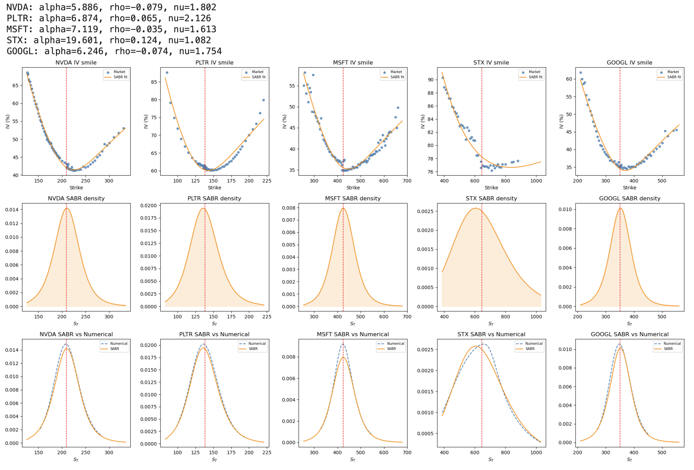

# Basket Option Pricing — AI Equity Basket

**European basket call on NVDA · PLTR · MSFT · STX · GOOGL**

---

## Overview

This project prices a European basket call option on five AI-sector equities using a three-stage framework that connects market-implied marginal distributions, copula-based dependence modelling, and variance-reduced Monte Carlo simulation. The workflow is structured as a Jupyter notebook split across four parts; Part 4 is currently in progress.

The motivation is a realistic sell-side structured products context: hedge funds and long-only managers demand basket options on high-profile AI names for leveraged, defined-risk thematic exposure. Pricing these correctly requires respecting each asset's implied volatility surface individually and modelling the joint terminal distribution with an appropriate dependence structure.

---

## Project Structure

```
.
├── basket_pricing_workbook.ipynb          # Main notebook (Parts 1–4)
├── functions_marginal_distributions.py    # SABR calibration, Breeden–Litzenberger, smile fitting
├── copula.py                              # Correlation estimation, copula sampling, Student-t MLE
└── README.md
```

---

## Part 1 — Risk-Neutral Marginal Distributions

**Goal:** Extract market-implied risk-neutral PDFs for each asset from the observed option chain.

**Pipeline:**

1. **Option chain ingestion.** Live option prices are fetched from Yahoo Finance. The most liquid expiry in the 14–90 day window is selected per asset.

2. **Smile construction.** Raw prices are converted to implied volatilities by numerically inverting the Black–Scholes formula using Brent's method.

3. **SABR calibration.** The SABR model is calibrated to each smile by minimising RMSE between the Hagan approximation and market IVs. Beta is fixed at 0.5 (standard equity convention), leaving three free parameters `(α, ρ, ν)` which are found using **Nelder-Mead algorithm**.

4. **Dense repricing.** Calibrated SABR vols are evaluated on a 500-point strike grid spanning `[0.6S, 1.6S]` and converted to call prices via Black–Scholes.

5. **Breeden–Litzenberger extraction.** The risk-neutral density is recovered as:

$$q(K) = e^{rT}\frac{\partial^2 C}{\partial K^2}$$

   Monotone prices are enforced via **isotonic regression**. The second derivative is computed using a **Savitzky–Golay** filter (more stable than finite differences). A light **Gaussian smoothing** is applied and the PDF is normalised to integrate to one.

6. The CDF is obtained by integrating the PDF using the trapezoidal rule.



7. **Cross-validation.** SABR densities are benchmarked against a numerical (SVI / smoothing-spline) extraction. The SABR density is preferred as the primary marginal because it produces well-behaved, monotone CDFs required by the copula in Part 2.


---

## Part 2 — Copula-Based Dependence Modelling

**Goal:** Model the joint terminal distribution of the five assets.

### Inverse CDF Construction

For each asset, the discrete `(K, CDF)` table from Part 1 is interpolated into a callable inverse CDF `F_k^{-1}`. Any uniform sample `U_k ~ U(0,1)` maps to a terminal price `S_k^T = F_k^{-1}(U_k)`, preserving the full shape of the market-implied marginal.

### Pearson vs Copula Correlation

The pairwise Pearson correlation matrix `R_pearson` is estimated from one year of daily log-returns. Critically, the Gaussian copula parameter `ρ_ij` is **not** the same as the Pearson correlation `r_ij` when marginals are non-Gaussian. Using `R_pearson` directly in the copula would produce simulated prices with incorrect pairwise correlations.

The correct copula parameter is recovered via Brent's root-finding: for each pair `(i, j)`, find `ρ_ij` such that:

$$\text{Corr}\left(F_i^{-1}(\Phi(Z_i)),\ F_j^{-1}(\Phi(Z_j))\right) = r_{ij}$$

where `(Z_i, Z_j) ~ N(0, I)` with correlation `ρ_ij`. The objective is evaluated on a fixed quasi-random set of 20,000 standard normal pairs for stability across Brent iterations. 


### Gaussian Copula

`n = 10,000` correlated standard normals are drawn via Cholesky decomposition of `R_copula`, transformed to uniforms `U_k = Φ(Z_k)`, and mapped to terminal prices via `F_k^{-1}`. The Gaussian copula has **zero tail dependence**: joint extreme moves are asymptotically independent.


### Student-*t* Copula

The Student-*t* copula introduces **symmetric tail dependence** via a shared chi-squared mixing variable. The tail dependence coefficient is:

$$\lambda = 2 t_{\nu+1}\left(-\sqrt{(\nu+1)\,\frac{1-\rho}{1+\rho}}\right) > 0$$

for any finite `ν`. The degrees-of-freedom parameter `ν` is estimated by maximum likelihood on historical log-returns. Lower `ν` implies heavier tails and stronger joint crash dependence, which is more realistic for equity baskets. 


**Diagnostics:** Uniform-space scatter plots confirm elliptical (Gaussian) vs. corner-clustered (Student-*t*) dependence. 
Marginal recovery checks verify that histogramming the simulated prices reproduces the SABR density from Part 1.


---

## Part 3 — Monte Carlo Pricing with Control Variate

**Contract parameters:**

| Parameter | Value |
|-----------|-------|
| Basket | Equal-weighted arithmetic average of 5 assets |
| Strike `K` | ATM = average of spot prices |
| Maturity `T` | Inherited from Part 1 option chain expiry |
| Risk-free rate `r` | 5% |
| Simulations | 10,000 |

**Payoff:**

$$V_T = \max\left(\frac{1}{5}\sum_{k=1}^{5} S_k^T - K,\ 0\right)$$

### Plain Monte Carlo

$$\hat{V}_0 = e^{-rT} \cdot \frac{1}{N_{\text{sim}}} \sum_{i=1}^{N_{\text{sim}}} V_T^{(i)}$$

Prices are computed under both copulas. The standard error quantifies Monte Carlo uncertainty.

### Control Variate: Normalised Geometric Basket

The geometric basket call has a known closed-form price (log-normal geometry). Since arithmetic and geometric basket payoffs are driven by the same simulated paths they are highly correlated. The control-variate estimator is:

$$\hat{V}^{CV} = \hat{V}^A - \beta\left(\hat{V}^G_{MC} - V^G_{\text{exact}}\right)$$

where `β = Cov(V̂^A, V̂^G) / Var(V̂^G)` is the OLS coefficient that minimises variance.

**Normalised construction.** The standard AM-GM approximation is only tight when the inputs are close to 1. The five assets trade at very different absolute price levels (NVDA ~\$900, PLTR ~\$24, etc.), so a geometric mean of raw prices is a poor proxy for the arithmetic basket. To correct this, each asset is normalised by its initial price:

$$S_k^*(T) = \frac{S_k(T)}{S_k(0)}, \qquad \alpha_k = \frac{S_k(0)}{\sum_j S_j(0)}, \qquad \sum_k \alpha_k = 1$$

The geometric basket in dollar terms is then:

$$\text{basket}_G = K \cdot \prod_k \bigl(S_k^*(T)\bigr)^{\alpha_k}$$

which starts at `K` at time zero (matching the arithmetic basket) and uses normalised price relatives that are all close to 1, making the AM-GM approximation accurate. The closed-form price uses the weighted geometric volatility `σ_G = sqrt(α @ Σ @ α)` where `Σ` is the annualised log-return covariance matrix, and the forward `F = K · exp(μ_G · T)`.

### Results

Both copula specifications are compared on price, standard error, and runtime under plain MC and CV MC. The Student-*t* copula prices the basket consistently **lower** than the Gaussian, consistent with its tail dependence concentrating more probability mass in joint crash scenarios and reducing the expected call payoff.

| Method | Copula | Price | SE | Var Reduction (%) | Runtime (s) |
| :--- | :--- | :--- | :--- | :--- | :--- |
| Plain MC | Gaussian | 19.9469 | 0.2808 | - | 0.0018 |
| Plain MC | Student-t | 19.1078 | 0.2753 | - | 0.0005 |
| Control Variate | Gaussian | 19.7614 | 0.1792 | 59.3% | 0.0127 |
| Control Variate | Student-t | 19.1088 | 0.1802 | 57.1% | 0.0144 |

> **Note:** The table above reflects a previous run. After applying the normalised geometric basket construction, re-running the notebook will produce updated SE and variance reduction figures, which are expected to improve.

The simulation results provide a clear comparison between standard estimation and variance reduction techniques across different dependence structures (Gaussian and Student-t copulas).

#### Table Analysis
The transition from **Plain Monte Carlo** to **Control Variate** methods shows a significant improvement in statistical reliability. The normalised geometric basket is a tighter proxy for the arithmetic basket than a naive equal-weight geometric mean of absolute prices, because all normalised price relatives $S_k^*(T)$ start at 1 and the AM-GM approximation is accurate. This produces a stronger geometric-arithmetic correlation across paths and a larger variance reduction. The **Standard Error (SE)** drops from approximately 0.28 to 0.18, and the reduction is expected to improve further with the corrected construction.

#### Computational Performance
The **Runtime** analysis shows that the added complexity of the Control Variate method is negligible (taking only fractions of a second). Given the massive gain in accuracy, the method proves to be highly efficient, providing a superior balance between computational effort and result stability.


#### Graphical Observations
The accompanying plots illustrate the practical impact of these numerical gains:
* **Volatility of Estimates:** The Plain MC trajectories show wider fluctuations and a slower approach to the mean.
* **Control Variate Efficiency:** The Control Variate paths exhibit much smoother behaviour and stabilise almost immediately. The narrowing of the confidence bands visually confirms the variance reduction reported in the table.
* **Copula Impact:** The Student-t copula prices the basket consistently lower than the Gaussian (\$19.11 vs \$19.95 under plain MC). This is consistent with theory: the Student-t copula introduces tail dependence via a shared chi-squared variable, concentrating more probability mass in joint crash scenarios and reducing the expected basket call payoff relative to the Gaussian copula, which treats extreme co-movements as asymptotically independent. The variance reduction technique remains equally robust regardless of the underlying copula specification.
---

## Part 4 — *In Progress*

Part 4 has not yet been implemented.

---

## Dependencies

```
numpy
pandas
scipy
matplotlib
yfinance
scikit-learn       # IsotonicRegression
```

Internal modules:

- `functions_marginal_distributions.py` — `fetch_option_chain`, `build_smile`, `calibrate_sabr`, `sabr_vol`, `bs_call_price`, `fit_smile`, `breeden_litzenberger`
- `copula.py` — `estimate_correlation`, `build_inverse_cdf`, `sample_gaussian_copula`, `estimate_nu`, `sample_student_copula`

---

## References

- Hagan, P. S., Kumar, D., Lesniewski, A. S., & Woodward, D. E. (2002). *Managing smile risk.* Wilmott Magazine.
- Breeden, D. T., & Litzenberger, R. H. (1978). *Prices of state-contingent claims implicit in option prices.* Journal of Business.
- Sklar, A. (1959). *Fonctions de répartition à n dimensions et leurs marges.* Publications de l'Institut de Statistique de l'Université de Paris.
